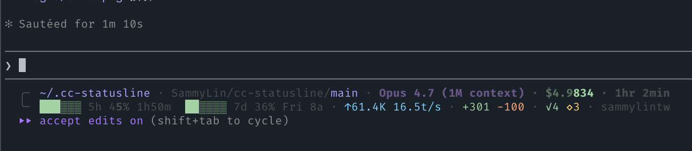

# cc-statusline

[](https://github.com/SammyLin/cc-statusline/actions/workflows/ci.yml)
[](https://opensource.org/licenses/MIT)
[](https://nodejs.org)
[](https://docs.claude.com/en/docs/claude-code)

A lightweight Claude Code statusline dashboard with a rounded multi-line layout — shows current dir, git, model, cost, quotas, MCP health, and more.

```
╭╴ ~/dotfile · SammyLin/cc-statusline/main! · Opus 4.7 (1M context) mx · $2.1939 · 20min
╰╴ ██░░░░ 5h 41% 2h13m  ██░░░░ 7d 36% Thu 4a · ↑32.6K 28.5t/s · +149 -69 · ✓4 ◇3 · sammylintw
```



## Features

- **Rounded layout** — prompt-style ╭╴ / ╰╴ two-line output (toggle to single-line via config)
- **Current directory** — auto-shortens long paths (`~/…/baz/deep`)
- **Session info** — model name + effort level, cost (delta-tracked across compactions), duration
- **Permission mode** — shows `edits` / `plan` / `yolo` when not in default mode (read from session transcript)
- **Quota bars** — 5h and 7d rate limit usage with %, reset countdown, and color-coded progress bars
- **Repo/branch** — git owner/repo, branch name, dirty indicator
- **Subagent tracker** — concurrent subagent runs
- **MCP health** — server status monitoring (healthy/failed/needs_auth)
- **Compact count** — context compaction tracking
- **Edited files** — recently modified files
- **Token speed** — rolling average tokens/sec
- **Account email** — shows logged-in account (from ~/.claude.json)
- **Themes** — default, nord, catppuccin (default, soft), dracula, pastel

## Configuration

All settings live in `lib/config.js`. Override via:

**Option 1: JSON config** — create `~/.claude/statusline-config.json`:
```json
{
  "theme": "catppuccin",
  "layout": "rounded",
  "powerline": false,
  "tokenSpeedWindow": 30,
  "quotaBarLen": 6,
  "showQuotaReset": true,
  "dirSegments": 2,
  "showDir": true,
  "showPermission": true,
  "showAccount": true,
  "showCompact": true,
  "showSubagent": true,
  "showMcp": true,
  "showEditedFiles": true,
  "showDirty": true
}
```

**Option 2: Env vars:**
```bash
export CC_STATUSLINE_THEME=dracula
export CC_STATUSLINE_LAYOUT=single
export CC_STATUSLINE_POWERLINE=true   # only used by `single` layout
```

## Themes

Available: `default`, `nord`, `catppuccin` (default, softened), `dracula`, `pastel`

## Installation

### Option A — Claude Code plugin (recommended)

```
claude plugin marketplace add SammyLin/cc-statusline
claude plugin install cc-statusline@cc-statusline
```

The plugin auto-registers all hooks (via `hooks/hooks.json`). You only need to add the `statusLine` block to your `~/.claude/settings.json`:

```json
{
  "statusLine": {
    "type": "command",
    "command": "node ~/.claude/plugins/marketplaces/cc-statusline/statusline.js",
    "refreshInterval": 30
  }
}
```

### Option B — manual

```bash
git clone https://github.com/SammyLin/cc-statusline ~/.cc-statusline
mkdir -p ~/.claude/hooks ~/.claude/lib
cp ~/.cc-statusline/statusline.js ~/.claude/statusline.js
cp ~/.cc-statusline/hooks/*.js ~/.claude/hooks/
cp -R ~/.cc-statusline/lib/. ~/.claude/lib/
```

Then add to `~/.claude/settings.json`:

```json
{
  "statusLine": {
    "type": "command",
    "command": "node ~/.claude/statusline.js",
    "refreshInterval": 30
  },
  "hooks": {
    "SubagentStart": [{ "matcher": ".*", "hooks": [{ "type": "command", "command": "node ~/.claude/hooks/subagent-tracker.js" }] }],
    "SubagentStop": [{ "matcher": ".*", "hooks": [{ "type": "command", "command": "node ~/.claude/hooks/subagent-tracker.js" }] }],
    "PreCompact": [{ "matcher": ".*", "hooks": [{ "type": "command", "command": "node ~/.claude/hooks/compact-monitor.js" }] }],
    "PostToolUse": [{ "matcher": "Write|Edit", "hooks": [{ "type": "command", "command": "node ~/.claude/hooks/file-tracker.js" }] }],
    "UserPromptSubmit": [{ "hooks": [
      { "type": "command", "command": "node ~/.claude/hooks/message-tracker.js" }
    ]}]
  }
}
```

## Hooks

| Hook | Event | Purpose |
|------|-------|---------|
| `subagent-tracker.js` | SubagentStart/Stop | Track subagent runs |
| `compact-monitor.js` | PreCompact | Count compaction events |
| `file-tracker.js` | PostToolUse (Write/Edit) | Record recently edited files |
| `message-tracker.js` | UserPromptSubmit | Cache recent messages |
| `mcp-status-refresh.js` | _spawned in background by `statusline.js`_ | Refresh `mcp-status-cache.json` by running `claude mcp list` (self-throttles to 90s) |

## License

MIT
